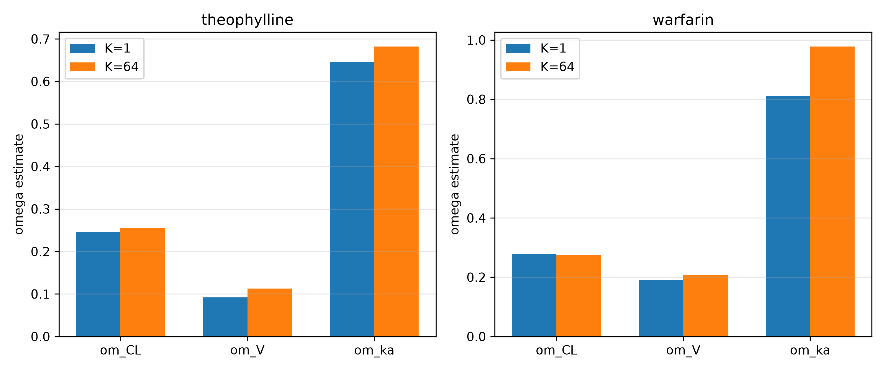
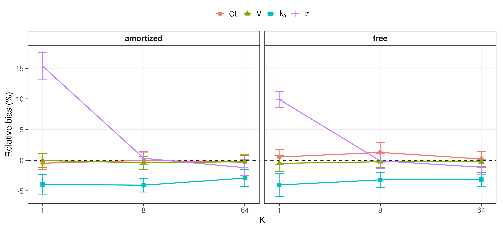
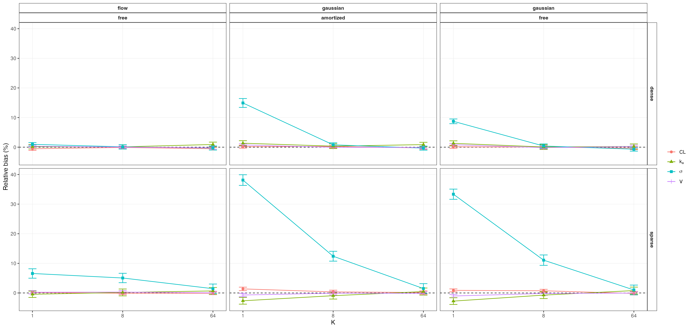

## Abstract

Nonlinear mixed-effects (NLME) models are widely used to characterize population-level effects and between-subject variability in pharmacokinetic and pharmacodynamic data. Established estimation methods such as first-order conditional estimation with interaction (FOCEI) and stochastic approximation expectation-maximization (SAEM) can become computationally demanding as population size and model complexity increase. Variational inference (VI) offers an optimization-based alternative, including amortized formulations that reuse a shared inference model across subjects and datasets. Across simulated and real data, we show that the standard evidence lower bound (ELBO; $K=1$) systematically underestimates between-subject variability, whereas the importance-weighted ELBO (IW-ELBO; $K>1$) and richer variational families substantially reduce this bias. In matched simulated data, VI at $K=64$ recovers fixed effects and between-subject variability with accuracy comparable to FOCEI and SAEM, with bias below 1.2% for every reported random-effect standard deviation, whereas $K=1$ reproduces the systematic underestimation observed throughout the study. The same pattern is observed in two independent real pharmacokinetic datasets (theophylline and warfarin). In a nonlinear Michaelis-Menten elimination model, the correction persists for identifiable random effects, while exploratory analyses reveal a cross-method identifiability limitation when variability is assigned simultaneously to both Michaelis-Menten parameters. We further show that likelihood-ratio tests based on recovered marginal likelihoods are not uniformly calibrated across posterior architectures: tests that alter the random-effect structure are miscalibrated under a per-subject free posterior but substantially improved under a shared amortized posterior. Finally, importance-sampling effective sample size distinguishes well-converged from deliberately under-trained fits without requiring ground truth. These results delineate when corrected VI provides accurate NLME estimation and identify settings in which posterior architecture or downstream inference requires additional safeguards.

## Introduction

Nonlinear mixed-effects (NLME) models are widely used to characterize population-level trends and between-subject variability in pharmacokinetic, pharmacodynamic, and related longitudinal data. They are particularly useful when repeated observations are collected from heterogeneous populations. Fitting an NLME model requires integrating over subject-specific random effects, an integral that is generally unavailable in closed form [@pinheiro1994topics]. Established estimation methods therefore rely on approximations. First-order conditional estimation with interaction (FOCEI) [@beal1980nonmem; @wang2008derivation] linearizes the model around each subject's conditional mode, whereas stochastic approximation expectation-maximization (SAEM) [@kuhn2005maximum] uses stochastic sampling within an iterative optimization scheme.

Variational inference (VI) approaches the same integration problem through optimization. A tractable approximate posterior is fit by maximizing a lower bound on the marginal likelihood, the evidence lower bound (ELBO). Recent work has extended this framework to *amortized* VI for NLME models, in which a shared neural encoder maps a subject's data to subject-specific posterior parameters [@arruda2024amortized]. Once trained, the encoder can be reused across subjects and potentially across related datasets, making amortized inference attractive in settings where repeated fitting is required.

A central limitation of the standard ELBO is that an imperfect variational approximation can produce a loose bound and distorted posterior uncertainty. Recent applications of VI to NLME models have noted underestimation of variability parameters [@tarek2026fitting; @li2026variational; @baaz2026empirical], but the phenomenon has not been systematically characterized across sampling designs, posterior architectures, and variational families. In NLME models, this issue is especially important because between-subject variability is often scientifically consequential and can influence downstream decisions such as covariate modeling and random-effect selection. It is therefore necessary to determine not only whether the bias occurs, but also whether it can be corrected and whether corrected point estimates are sufficient for downstream likelihood-based inference.

In this work, we systematically characterize the dependence of between-subject variability estimates on the number of importance samples, $K$, under the standard ELBO ($K=1$) and IW-ELBO ($K>1$). We examine dense and sparse sampling designs, free and amortized posterior architectures, and Gaussian and normalizing-flow variational families. We benchmark corrected VI against FOCEI and SAEM on matched simulated datasets, test whether the same pattern reproduces in two real pharmacokinetic datasets, and extend the analysis to a nonlinear Michaelis-Menten elimination model. We further evaluate importance-sampling effective sample size as a practical diagnostic of fit quality and assess whether recovered marginal likelihoods support calibrated likelihood-ratio testing for changes in random-effect structure. Together, these experiments identify where VI provides reliable NLME estimation, where importance weighting materially improves accuracy, and where posterior architecture remains important for downstream inference.

## Methods

### NLME Model and the Variational Inference Objective

For a population of $N$ subjects, each subject $i$ contributes
observations $y_{ij}$ at times $t_{ij}$, $j = 1, \ldots, n_i$, generated
by a structural model $f$ evaluated at subject-specific parameters
$\phi_i$:

$$
y_{ij} = f(t_{ij}, \phi_i) \cdot \exp(\epsilon_{ij}), \qquad
\epsilon_{ij} \sim \mathcal{N}(0, \sigma^2),
$$ {#eq-residual-error}

a log-normal (multiplicative) residual error model, equivalently additive
on the log scale:

$$
\log y_{ij} = \log f(t_{ij}, \phi_i) + \epsilon_{ij}.
$$ {#eq-log-residual-error}

Subject-specific parameters are linked to population-level fixed effects
$\theta$ and subject-specific random effects $\eta_i$ through a
log-normal population model,

$$
\phi_i = \theta \odot \exp(\eta_i), \qquad
\eta_i \sim \mathcal{N}(0, \Omega),
$$ {#eq-population-model}

with $\Omega$ diagonal (independent random effects) throughout this work. We parameterize the diagonal covariance matrix in terms of random-effect standard deviations,

$$
\Omega = \operatorname{diag}(\omega_1^2, \ldots, \omega_p^2),
$$

where $\omega_j$ denotes the between-subject standard deviation for random effect $j$. Accordingly, reported quantities such as $\omega_{CL}$, $\omega_V$, and $\omega_{k_a}$ are standard deviations rather than variances. In prose, we use *between-subject variability* (BSV) when referring to this variability conceptually and reserve $\Omega$ for the covariance matrix.

The population-level likelihood contribution of subject $i$ requires
integrating the random effects out of the joint density,

$$
p(y_i \mid \theta, \Omega, \sigma^2) =
\int p(y_i \mid \phi_i, \sigma^2) \, p(\eta_i \mid \Omega) \, d\eta_i,
$$ {#eq-marginal-likelihood}

an integral with no closed form for any structural model $f$ beyond the
simplest linear cases, and the central computational obstacle every NLME
estimation method must address.

Variational inference replaces this integral with an optimization
problem. For a tractable variational family $q_\lambda(\eta_i)$, the
standard evidence lower bound (ELBO) satisfies:

$$
\log p(y_i \mid \theta, \Omega, \sigma^2) \;\geq\;
\mathbb{E}_{\eta_i \sim q_\lambda(\eta_i)}
\Big[ \log p(y_i \mid \eta_i, \theta, \sigma^2) +
\log p(\eta_i \mid \Omega) - \log q_\lambda(\eta_i) \Big]
\;=:\; \mathrm{ELBO}_i(\lambda),
$$ {#eq-elbo}

and population parameters are estimated by maximizing
$\sum_i \mathrm{ELBO}_i(\lambda_i)$ jointly over the variational
parameters $\lambda_i$ and $(\theta, \Omega, \sigma^2)$. Because this
bound need not be tight, we additionally use the $K$-sample
importance-weighted ELBO (IW-ELBO) [@burda2016importance]:

$$
\mathrm{ELBO}_i^{(K)}(\lambda) =
\mathbb{E}_{\eta_i^{(1)}, \ldots, \eta_i^{(K)}
\overset{\text{iid}}{\sim} q_\lambda(\eta_i)}
\left[ \log \frac{1}{K}\sum_{k=1}^{K}
\frac{p(y_i, \eta_i^{(k)} \mid \theta, \Omega, \sigma^2)}
{q_\lambda(\eta_i^{(k)})} \right],
$$ {#eq-iw-elbo}

which is provably a tighter lower bound for larger $K$ and converges to
the true marginal log-likelihood as $K \to \infty$; $K=1$ recovers the
standard ELBO exactly. We fit models at $K \in \{1, 8, 64\}$ throughout,
treating $K=1$ as the baseline against which the importance-weighting
correction is measured. A post-hoc, higher-precision importance-sampling
estimate of the marginal likelihood (independent of the training $K$) is
also used to place fitted models on the same objective-function-value
(OFV) scale conventionally reported by FOCEI/SAEM software, $\mathrm{OFV}
= -2 \log p(y \mid \theta, \Omega, \sigma^2)$.

### Variational Posterior Families

We cross two independent design choices for the variational posterior.

**Free vs. amortized.** A *free* posterior assigns each subject $i$ its
own variational parameters $\lambda_i = (\mu_i, s_i)$, optimized
independently subject by subject. An *amortized* posterior instead learns
a single shared encoder $\lambda_i = g_\psi(y_i)$ mapping any subject's
observed data directly to variational parameters, so that inference for a
new subject requires only a forward pass through $g_\psi$ rather than a
fresh per-subject optimization, the property that makes amortized VI
attractive for reuse across new datasets [@arruda2024amortized].

**Gaussian vs. normalizing flow.** Within either posterior architecture,
the variational family itself may be a simple diagonal Gaussian,
$q(\eta_i) = \mathcal{N}(\mu_i, \mathrm{diag}(s_i^2))$, or a richer family
constructed via a conditional normalizing flow
[@rezende2015variational; @papamakarios2021normalizing]. In the flow
case, a latent variable $z_i \sim \mathcal{N}(0, I)$ is transformed by an
invertible, differentiable map $h_\psi$ conditioned on the base
posterior's parameters,

$$
\eta_i = h_\psi(z_i \,;\, \mu_i, s_i), \qquad
\log q(\eta_i) = \log \mathcal{N}(z_i; 0, I) -
\log \left| \det \frac{\partial h_\psi}{\partial z_i} \right|,
$$ {#eq-flow-density}

allowing $q$ to represent non-Gaussian posterior shapes (skew,
multimodality) that a diagonal Gaussian cannot. Crossing both design axes
gives four posterior configurations (free/amortized $\times$
Gaussian/flow); as detailed in the Results, one configuration (amortized
+ flow) is unstable and excluded from primary results.

### Training and Convergence

All models are trained via stochastic gradient ascent on
$\mathrm{ELBO}^{(K)}$ using Adam, with training continued adaptively
until the estimated random-effect standard deviations $\omega$ themselves plateau (rather than a
fixed step count or loss-based stopping rule, which we found could
converge in loss while the $\omega$ estimates were still drifting), subject to a safety
cap. The best-performing checkpoint by training objective is retained
regardless of where training terminates, guarding against a fit wandering
into and remaining in a poor basin late in training.

### Simulation Study Design

**Linear tier.** A one-compartment oral pharmacokinetic model with
first-order absorption and elimination (analytic solution, no numerical
integration required) is used as the primary simulated test bed, with
population parameters drawn from typical published ranges (clearance
$CL$, volume $V$, absorption rate $k_a$, each with independent
between-subject variability, and multiplicative residual standard deviation $\sigma$).
Two sampling designs are compared at matched $K$: a dense design with six
observation times per subject, and a sparse design with fewer, more
widely spaced observations, to test whether the standard-ELBO bias
interacts with the identifiability of the sampling schedule itself.

**Nonlinear tier.** A one-compartment intravenous bolus model with
saturable, Michaelis-Menten elimination,

$$
\frac{dA}{dt} = -\frac{V_{\max} \cdot (A/V)}{K_m + (A/V)}, \qquad
A(0) = \mathrm{Dose},
$$ {#eq-michaelis-menten}

has no closed-form solution and is integrated numerically (fixed-step
RK4) at every training step, providing a genuinely nonlinear test of
whether the standard-ELBO bias and its correction survive outside the
analytically convenient linear case. Between-subject variability is
placed on $V_{\max}$ and $V$ only, with $K_m$ estimated as a fixed effect
without a random effect, both because placing independent between-subject
variability on both Michaelis-Menten parameters simultaneously is a
recognized cross-method identifiability difficulty in nonlinear
mixed-effects modeling of saturable kinetics, not specific to variational
inference, and because this was directly confirmed empirically in
preliminary analyses (see Results). The dosing and sampling design (dose
and an observation window spanning approximately 60 hours) was chosen
specifically to ensure the simulated concentration trajectory crosses
from the fully saturated regime into the first-order elimination regime
within the observation window; simulation confirmed that a substantially
shorter window remains entirely within the saturated regime, in which the
Michaelis-Menten equation is structurally insensitive to $K_m$, and does
not permit identification of $K_m$'s population value at all,
independent of any variational-inference consideration.

**Design consistency.** Throughout, a single random seed generates one
simulated dataset per replicate, and every estimation-method arm being
compared (posterior architecture, family, $K$) is fit to the identical
dataset, so that differences between arms reflect only the estimation
method and not sampling variability in the simulated data.

### Real-Data Validation

Two independent, publicly available pharmacokinetic datasets are used to
test whether the simulation-derived findings reproduce on real data,
where, unlike simulation, no ground truth is available and the signature
to look for is instead internal consistency: whether $K=1$ under-reports
the random-effect standard deviations $\omega$ relative to $K=64$ on the identical dataset, and whether
fixed-effect estimates are externally plausible.

**Theophylline.** The Boeckmann/Sheiner/Beal theophylline dataset
[@boeckmann1994nonmem] ($N=12$ subjects, oral dosing) is loaded
programmatically rather than transcribed by hand.

**Warfarin.** The classical warfarin pharmacokinetic/pharmacodynamic
dataset [@oreilly1968studies] ($N=33$ subjects, single oral dose) is
used, restricted to its pharmacokinetic (plasma concentration) endpoint;
the dataset also contains a pharmacodynamic (prothrombin complex
activity) endpoint not modeled here. Fitted fixed effects are compared
directly against an independently published FOCEI fit of this dataset
using the `nlmixr2` software package [@fidler2019nonlinear], which uses a
more detailed two-step transit-compartment absorption structure than the
simple first-order absorption model used here.

### Diagnostics: Importance-Sampling Effective Sample Size

Because no ground truth is available on real data, we additionally
characterize a diagnostic derived from the post-hoc importance-sampling
marginal-likelihood estimate: the effective sample size (ESS) of the
importance weights, which should be low when the variational posterior is
a poor approximation to the true posterior (as when a fit is
under-trained) and high when it is a good approximation. This diagnostic
is validated by deliberately comparing well-converged and deliberately
under-trained fits on identical simulated data and testing whether ESS
separates the two groups.

### Likelihood-Ratio Test Calibration

To test whether the marginal likelihood recovered via importance sampling
is valid for likelihood-ratio-based model comparison, we simulate data
under a null hypothesis in which one random effect's variance is exactly
zero, fit both a reduced model (without that random effect) and a full
model (with it) to the identical simulated data, and compare the
empirical distribution,

$$
\Delta\mathrm{OFV} = \mathrm{OFV}_{\text{reduced}} -
\mathrm{OFV}_{\text{full}}
$$ {#eq-delta-ofv}

against its correct theoretical reference distribution. Testing a
variance component against the boundary of its parameter space
($\mathrm{Var} \geq 0$) is a non-regular testing problem: under the null,
the boundary constraint means the reduced model's likelihood exceeds the
full model's roughly half the time by chance alone, and the correct
asymptotic reference distribution is not $\chi^2_1$ but the Self-Liang
boundary mixture [@self1987asymptotic]:

$$
\Delta\mathrm{OFV} \;\big|\; H_0 \;\sim\;
\tfrac{1}{2}\,\delta_0 \;+\; \tfrac{1}{2}\,\chi^2_1,
$$ {#eq-self-liang-mixture}

a 50:50 mixture of a point mass at zero and a standard $\chi^2$ random
variable with one degree of freedom. Calibrating against the naive
$\chi^2_1$ reference instead would produce a silently underpowered test
(the naive test's nominal 5% type-I error rate corresponds to only 2.5%
under the true mixture reference); we calibrate against the correct
mixture throughout, evaluating both the fraction of null replicates
landing at the boundary (expected $\approx 50\%$) and, for the
strictly-positive replicates, a Kolmogorov-Smirnov test against
$\chi^2_1$.

### Comparison to Established Estimation Methods

FOCEI and SAEM baseline fits are obtained via the `nlmixr2` R package
[@fidler2019nonlinear], using a structural model and log-normal residual
error model matched exactly to the VI implementation's
`OneCmtOral`: identical parameterization ($\log CL = \theta_{CL} +
\eta_{CL}$, and analogously for $V$ and $k_a$), and the same off-truth
initial values used throughout this work for both estimation approaches,
so that neither starts closer to the truth than the other. The
comparison uses $N=120$ subjects and 20 replicate simulated datasets,
matching the scale used for the linear-tier simulation study above; each
replicate is fit once by FOCEI, once by SAEM, and by variational
inference at $K=1$ and $K=64$, all on the identical simulated dataset.
Runtime is measured as process CPU time, not wall-clock time, for both
the variational inference fits (Python's `time.process_time()`) and the
FOCEI/SAEM fits (R's `proc.time()`, summing the user and system
components), consistent throughout this work specifically because
process CPU time is immune to operating-system sleep and largely immune
to contention from other processes, unlike wall-clock time. Thread
counts were not explicitly pinned to be identical between the PyTorch
and R/BLAS processes; this is a limitation of the runtime comparison
reported below (see Limitations), since incidental differences in
parallelism could confound a small part of the observed speed
difference.

This runtime comparison is scoped deliberately to a single, simple,
analytically tractable structural model, chosen specifically to allow a
fair, matched comparison in which both sides evaluate the likelihood via
a closed-form solution rather than numerical integration. It is not
intended as the paper's primary evidence for variational inference's
practical efficiency advantage, which is expected to be most pronounced
for larger populations and structurally more complex models where FOCEI
and SAEM's per-iteration cost scales unfavorably, an advantage already
established in the literature at larger scale (@arruda2024amortized
report roughly two orders of magnitude speedup on their tested models).
The purpose of the comparison reported here is narrower: to verify that
the BSV-bias correction characterized throughout this work brings
variational inference to FOCEI/SAEM-comparable accuracy without
introducing a prohibitive runtime cost on a tractable model, not to make
a general efficiency claim.

### Software and Computational Environment

All variational inference models are implemented in PyTorch
[@paszke2019pytorch]. FOCEI and SAEM baseline fits use the `nlmixr2` R
package [@fidler2019nonlinear] (version 7.0.1, with `nlmixr2est` 7.0.2
and `rxode2` 5.1.6) under R version 4.5.3 (aarch64-apple-darwin20) on
macOS.

## Results

### Standard-ELBO Variational Inference Underestimates Between-Subject Variability

On the linear one-compartment model with known ground truth, standard-ELBO ($K=1$) fitting systematically underestimates between-subject variability under both free and amortized posteriors, with the bias substantially reduced by importance weighting at larger $K$ (@fig-phase0-omega-bias and @supptbl-phase0-combined). Structural fixed effects show much less dependence on $K$. Clearance and volume remain comparatively stable, whereas $k_a$ is consistently underestimated by a similar amount across $K$, indicating a persistent bias that is distinct from the strongly $K$-dependent behavior of the random-effect parameters. Residual-error estimates show greater $K$-dependence in some settings, consistent with partial compensation between residual and between-subject variability (@supptbl-phase0-combined; @suppfig-phase0-fixed-effects).

{#fig-phase0-omega-bias}

### Sparse Sampling Designs and Richer Variational Families

Sparse sampling designs roughly double the standard-ELBO bias relative to
dense sampling at matched $K$, consistent with the mechanism being one of
identifiability: whichever random effect the sampling design least
constrains shrinks the most under standard-ELBO training. Independently, a
richer variational family (normalizing flow) closes most of the gap that
importance-weighting alone leaves at low $K$, with the free posterior
under the flow family showing negligible bias even at $K=1$ in the dense
design (@fig-phase1-grid and @supptbl-phase1-dense and @supptbl-phase1-sparse). Structural fixed-effect estimates are substantially less sensitive to $K$ across the same grid, whereas residual-error estimates show greater dependence on $K$ in some panels, consistent with redistribution of unexplained variability between residual error and between-subject random effects (@supptbl-phase1-dense and @supptbl-phase1-sparse; @suppfig-phase1-fixed-effects).

{#fig-phase1-grid}

One posterior configuration, amortized posterior combined with the
normalizing-flow family, is unstable across every tested value of $K$ and
is excluded from the results above. Rather than a $K=1$-specific problem,
this combination shows a comparable rate of flagged, substantially
divergent fits at $K=1$, $K=8$, and $K=64$ alike; higher $K$ changes the
character of the failure (from occasional gross divergence to more
consistent convergence onto a stable but incorrect estimate) without
reducing its frequency. We attribute this to the amortized encoder's
output serving a double role under this configuration, simultaneously
defining the flow's base distribution and its conditioning input,
creating a moving optimization target not present when either the
posterior is not amortized or the family is not a flow. A preliminary
architectural variant decoupling these two roles, following the design
used by @arruda2024amortized, is discussed as future work in the
Discussion.

### Nonlinear Elimination Kinetics

Extending to the Michaelis-Menten elimination model, an initial attempt
to place between-subject variability on both $V_{\max}$ and $K_m$
simultaneously showed severe, stable bias in $\omega_{K_m}$ (on the order
of $-80\%$ to $-90\%$) that did not improve with additional training
steps or a redesigned sampling window, while $\omega_{V_{\max}}$'s bias
remained modest throughout, a pattern consistent with a genuine
structural identifiability limitation of estimating variability on both
Michaelis-Menten parameters simultaneously, a difficulty recognized in
standard pharmacometric practice for saturable-kinetics models and not
specific to variational inference. Restricting between-subject
variability to $V_{\max}$ and $V$ only, with $K_m$ retained as a
population-level fixed effect, resolves this: fixed effects recover
cleanly, and the same $K=1$-to-$K=64$ shrinkage-and-correction signature
seen in the linear tier reproduces on $\omega_V$; $\omega_{V_{\max}}$'s
bias is small and essentially flat across $K$ in this design, with
little shrinkage at $K=1$ to correct (@fig-phase1-nonlinear and
@supptbl-phase1-q3-nonlinear).

{#fig-phase1-nonlinear}

We additionally tested the amortized posterior on this same nonlinear
model and found a distinct, substantial instability, not the
amortized-flow instability described above, since no flow is involved,
with bias in the random-effect standard deviations increasing rather than decreasing with $K$ and a
non-trivial fraction of fits failing to converge within the training
budget. Results using the amortized posterior on this model are excluded
from the table and figure above and discussed further, with candidate
explanations, in the Discussion below.

### Real-Data Validation

Both real pharmacokinetic datasets reproduce the standard-ELBO shrinkage
signature identified in simulation: $K=1$ reports smaller random-effect standard deviations than
$K=64$ on the identical dataset, with the clearance random effect showing
the least shrinkage of the three, consistent with clearance being the
most robustly identified parameter throughout the simulated results above
(@fig-realdata-k1-vs-khigh and @supptbl-realdata-k1-vs-khigh). On warfarin,
fixed-effect estimates for clearance and volume of distribution fall
inside the published 95% confidence intervals of an independently fitted
FOCEI model on the same data [@fidler2019nonlinear] despite this work's
simpler one-compartment, single-step absorption structure versus the
published model's two-step transit-compartment absorption, a real,
external agreement on the parameters that should agree given the shared
elimination structure, not merely a directional match.

{#fig-realdata-k1-vs-khigh}

### Diagnosing Fit Quality via Effective Sample Size

Mean importance-sampling effective sample size cleanly separates
deliberately under-trained fits from well-converged fits on matched
simulated data (@fig-psis-ess and @supptbl-psis-ess), supporting its use as a
practical diagnostic on real data where no ground truth is available to
check convergence directly. A fixed per-subject tail-count threshold does
not separate the two groups as cleanly, reflecting genuine
subject-to-subject variation in fit difficulty independent of overall
training adequacy; we therefore recommend the aggregate (mean or median)
ESS as the primary diagnostic, not a fixed per-subject threshold.

{#fig-psis-ess}

### Validity of the Recovered Likelihood for Model Selection

Likelihood-ratio tests built on the free posterior's recovered marginal
likelihood were miscalibrated against the correct Self-Liang boundary
mixture reference for testing whether a random effect's variance is zero
(@fig-deltaofv-calibration). Under the free posterior, only 25% of 100
null replicates fell within the prespecified boundary region, compared
with the approximately 50% expected under the theoretical mixture; 22
replicates produced negative $\Delta\mathrm{OFV}$ values. Among the
strictly positive replicates, the distribution also deviated from
$\chi^2_1$ (Kolmogorov-Smirnov $D=0.2922$, $p<0.0001$), although the
empirical type-I error using the correct boundary-mixture cutoff was 6%,
close to the nominal 5% level. The complete numerical calibration summary
is provided in @supptbl-deltaofv-calibration.

This miscalibration was not explained by insufficient post-hoc
importance-sampling precision: increasing the post-hoc evaluation sample
size fivefold left the calibration essentially unchanged, including a
highly discrepant replicate whose $\Delta\mathrm{OFV}$ value remained
nearly unchanged. Switching to an amortized posterior substantially
improved the boundary-mass component of the calibration, reproducibly at
two independent replicate counts, although a smaller residual deviation
in the shape of the non-boundary distribution remained. We attribute the
free posterior's miscalibration to an effective-degrees-of-freedom
mismatch: the more-complex model receives an additional free variational
parameter pair for every subject, far exceeding the single
population-level variance parameter nominally being tested. Classical
asymptotic theory, including the Self-Liang boundary-mixture reference,
does not account for this per-subject asymmetry; a shared amortized
encoder does not introduce the same increase in subject-specific
variational parameters.

{#fig-deltaofv-calibration}

This finding is scoped specifically to likelihood-ratio comparisons that
change the number of random effects; it does not affect the BSV-bias
correction findings reported above, which never depended on nested-model
comparison.

### Comparison to Established Estimation Methods

On matched simulated data ($N=120$ subjects, 20 replicates), FOCEI,
SAEM, and variational inference at $K=64$ recover both fixed effects and
the random-effect standard deviations with closely comparable accuracy, while $K=1$ reproduces the
same systematic underestimation of the random-effect standard deviations established throughout the
linear-tier results above (@tbl-baseline-comparison). Fixed-effect bias
is small for every method (under 2.1% in magnitude across $CL$, $V$, and
$k_a$ for FOCEI, SAEM, and both VI arms alike), showing that structural fixed effects were comparatively well recovered in this matched benchmark. For the random-effect standard deviations, FOCEI and SAEM show bias no larger than 3.6% on any parameter
($\omega_{k_a}$: $-3.6\%$ and $-1.25\%$ respectively); VI at $K=64$
matches this closely, with bias under 1.2% on every $\omega$ parameter
($\omega_{CL}$: $-0.30\%$, $\omega_V$: $+1.15\%$, $\omega_{k_a}$:
$-1.18\%$). VI at $K=1$, by contrast, shows the characteristic pattern
identified throughout this work: $\omega_V$ and $\omega_{k_a}$ biased by
$-14.3\%$ and $-21.9\%$ respectively, an order of magnitude larger than
FOCEI, SAEM, or VI at $K=64$ on the same parameters. A parallel pattern
holds for the residual-error parameter $\sigma$: FOCEI, SAEM, and VI at
$K=64$ all recover $\sigma$ within 2% of its true value, while VI at
$K=1$ overestimates it by 7.4%.



: Mean parameter estimates by method (FOCEI, SAEM, variational inference
at $K=1$ and $K=64$) against ground truth, $N=120$ subjects, 20
replicates. {#tbl-baseline-comparison}

Mean process CPU time, both sides now evaluating the model via a
closed-form analytic solution, was 11.25s for FOCEI, 12.68s for SAEM,
5.14s for VI at $K=1$, and 16.50s for VI at $K=64$. At $K=1$,
variational inference is modestly faster than both established methods
(2.2x versus FOCEI, 2.5x versus SAEM). At $K=64$, this reverses: VI is
slower than both (FOCEI is roughly 1.5x faster, SAEM roughly 1.3x
faster), reflecting the direct computational cost of the
importance-weighting correction itself. This asymmetry is precisely the
point made in the Methods scoping paragraph above: on this simple,
analytically tractable model, correcting the $K=1$ bias to
FOCEI/SAEM-comparable accuracy is not free, and the net runtime effect
depends on $K$, not a uniform variational-inference advantage. This
result should not be read as evidence against variational inference's
practical value, which this work's broader case rests on accuracy (see
above) together with runtime advantages already established in the
literature for larger, structurally more complex models
(@arruda2024amortized); it is evidence that, for models simple enough
to admit a closed-form solution, the runtime case for variational
inference is genuinely mixed rather than uniformly favorable. Thread
counts were not explicitly pinned to be equal between the PyTorch and
R/BLAS processes; see Limitations.

## Discussion

Across simulated and real data, we observed a consistent dependence of between-subject variability estimates on the tightness of the variational objective. Under the standard ELBO ($K=1$), random-effect variability was systematically underestimated, whereas larger $K$ under the IW-ELBO substantially reduced this bias. The same pattern was observed in both free and amortized posterior architectures, across dense and sparse sampling designs, and in a nonlinear model requiring numerical integration. Direct comparison on matched simulated datasets further showed that VI at $K=64$ recovered fixed effects and between-subject variability with accuracy comparable to FOCEI and SAEM. Thus, the improvement at larger $K$ is not merely an internal change within VI; it brings the resulting point estimates close to those from established NLME estimators under the conditions studied here.

The companion fixed-effect analyses clarify the specificity of this result. Structural fixed effects were generally much less sensitive to $K$ than the random-effect parameters. In Phase 0, $k_a$ remained consistently underestimated across all tested values of $K$, suggesting a persistent estimation or information limitation distinct from the $K$-dependent variability bias. Residual-error estimates were more sensitive to $K$ in some settings and tended to improve as between-subject variability increased toward its generating value. This pattern is consistent with partial compensation between residual and between-subject variability: when random-effect variability is underestimated, some unexplained variation can be absorbed by the residual-error term. The principal effect of increasing $K$ is therefore better described as improved allocation and recovery of variability rather than a general correction of all parameter bias.

The results also show that posterior architecture and variational family cannot be treated as interchangeable implementation details. Free-posterior normalizing flows substantially reduce variability bias even at low $K$ in well-identified designs. In contrast, the amortized-flow configuration tested here was unstable across all values of $K$. A plausible explanation is that the amortized encoder output serves two roles simultaneously in this architecture: it parameterizes the flow's base distribution and also conditions the flow transformation, creating a moving optimization target. The amortized-flow architecture of @arruda2024amortized avoids this coupling by using a fixed standard-normal base distribution and reserving encoder-derived summaries for conditioning. A preliminary decoupled implementation following that design produced plausible estimates in a small-scale test, but it has not yet been evaluated at the scale required for inclusion as a formal result.

A distinct instability was observed when the amortized Gaussian posterior was applied to the nonlinear Michaelis-Menten model. Because no flow was involved, this behavior cannot be explained by the same base-distribution coupling. A diagnostic feature of this failure is that it worsens, rather than improves, with increasing $K$, the opposite of the pattern observed everywhere else in this work. This directionality is consistent with a known pathology of importance-weighted training objectives: increasing $K$ improves the gradient signal-to-noise ratio for global model parameters but degrades it specifically for inference-network parameters [@rainforth2018tighter], a problem the doubly-reparameterized gradient estimator was designed to address but which was not used in the amortized fits reported here. This may compound with a harder representation problem, since a single shared encoder must map subject trajectories spanning saturated, transitional, and approximately first-order elimination regimes onto variational parameters, a substantially more complex mapping than in the linear tier, and consistent with known limits on when amortized inference can match a per-subject (free) solution [@margossian2024amortized]. Both explanations remain unconfirmed; distinguishing an encoder-optimization failure from a representation-capacity limitation, for example via encoder gradient diagnostics across $K$ or a semi-amortized warm-start, is noted as future work below.

The nonlinear analysis also highlighted an identifiability issue that should be distinguished from VI-specific approximation error. Allowing independent between-subject variability on both $V_{\max}$ and $K_m$ produced severe and persistent bias in the variability associated with $K_m$, even after extending training and redesigning the sampling window. Restricting between-subject variability to $V_{\max}$ and $V$, while retaining $K_m$ as a fixed effect, resolved the most severe instability. This behavior is consistent with the known correlation and identifiability challenges associated with simultaneous estimation of Michaelis-Menten parameters in saturable systems. A direct FOCEI/SAEM comparison on the same nonlinear model would provide a stronger cross-method confirmation of this interpretation.

The likelihood-ratio calibration experiments show that accurate point estimates do not guarantee valid downstream likelihood-based inference. When nested models differed in random-effect structure, the free posterior produced substantially too little boundary mass relative to the Self-Liang reference distribution. Increasing the precision of the post-hoc importance-sampling evaluation did not resolve the discrepancy, arguing against finite-sample importance-sampling noise as the primary explanation. In contrast, the amortized posterior substantially restored the expected boundary behavior. The effective-degrees-of-freedom interpretation provides a plausible explanation: adding a random effect under a free posterior introduces additional subject-specific variational parameters for every subject, whereas the classical likelihood-ratio reference accounts only for the population-level parameter being tested. The shared amortized encoder does not introduce the same per-subject asymmetry. A smaller residual deviation in the positive part of the null distribution remains unexplained.

The real-data analyses provide an important complement to the simulations. Both theophylline and warfarin showed smaller random-effect variability estimates at $K=1$ than at $K=64$ on the same data, reproducing the direction of the simulation result without access to ground truth. On warfarin, clearance and volume estimates were also compatible with published FOCEI confidence intervals despite differences in structural absorption models. These findings support the relevance of the simulation-derived pattern to practical pharmacokinetic analyses, while the small size of the theophylline dataset also emphasizes that residual high-$K$ variability bias may reflect classical small-sample estimation effects in addition to variational approximation error.

The direct runtime comparison should be interpreted narrowly. On the simple analytic one-compartment model used for the benchmark, VI at $K=1$ was faster than FOCEI and SAEM, whereas VI at $K=64$ was slower because of the direct computational cost of importance weighting. This result does not support a uniform speed advantage for corrected VI on simple models. Rather, it shows that improved accuracy at larger $K$ carries a measurable computational cost. Potential efficiency advantages are more likely to emerge for larger populations, repeated inference, amortized workflows, or structurally complex models, consistent with prior work [@arruda2024amortized].

### Limitations and Future Directions

Several limitations should be considered. First, thread counts were not explicitly matched between PyTorch and R/BLAS processes in the runtime benchmark, so differences in incidental parallelism may contribute to the observed timing differences. Second, the FOCEI/SAEM comparison was performed only for the linear model. Extending the benchmark to the Michaelis-Menten model would strengthen the interpretation of the nonlinear identifiability results. Third, this study evaluates one linear and one nonlinear structural model; generalization to multicomponent models, correlated random effects, covariate models, time-varying dosing, and other residual-error structures remains to be established. Fourth, the smaller residual miscalibration in the positive component of the amortized-posterior likelihood-ratio test remains unexplained.

Future work should therefore focus on production-scale evaluation of the decoupled amortized-flow architecture, diagnostic investigation of the amortized-Gaussian nonlinear instability (encoder gradient variance across $K$, encoder capacity, and semi-amortized initialization), direct FOCEI/SAEM benchmarking on nonlinear models, explicit control of computational parallelism in runtime comparisons, and extension to more complex NLME structures. Because numerical integration dominated the cost of the nonlinear experiments, evaluating differentiable, purpose-built ODE solvers such as `DifferentialEquations.jl` [@rackauckas2017differentialequations], as used by @arruda2024amortized for more structurally complex models, may also be worthwhile provided that solver changes do not alter the statistical comparison being made.

## References

::: {#refs}
:::

## Supplementary Material

### Supplementary Tables

::: {#supptbl-phase0-combined}


Values are mean relative bias (%) with the standard deviation across replicates in parentheses. BSV, between-subject variability; RUV, residual unexplained variability. BSV parameters ($\omega$) are reported as standard deviations.
:::

::: {#supptbl-phase1-dense}


Values are mean relative bias (%) with the standard deviation across replicates in parentheses. BSV, between-subject variability; RUV, residual unexplained variability. BSV parameters ($\omega$) are reported as standard deviations.
:::

::: {#supptbl-phase1-sparse}


Values are mean relative bias (%) with the standard deviation across replicates in parentheses. BSV, between-subject variability; RUV, residual unexplained variability. BSV parameters ($\omega$) are reported as standard deviations.
:::

::: {#supptbl-phase1-q3-nonlinear}


Mean parameter estimates for the Michaelis-Menten elimination model at each $K$. Relative bias (%) is shown in parentheses; ground-truth values are provided for reference.
:::

::: {#supptbl-realdata-k1-vs-khigh}


Parameter estimates at $K=1$ versus $K=64$ for the theophylline and warfarin datasets, with percent difference between the two estimates.
:::

::: {#supptbl-psis-ess}


Aggregate importance-sampling effective sample size by fit-quality arm.
:::

::: {#supptbl-deltaofv-calibration}


$\Delta\mathrm{OFV}$ calibration summary: boundary fraction, number of negative $\Delta\mathrm{OFV}$ values, Kolmogorov-Smirnov statistic and p-value against $\chi^2_1$ for the strictly positive replicates, and empirical type-I error using the correct Self-Liang boundary-mixture cutoff.
:::

### Supplementary Figures

::: {#suppfig-phase0-fixed-effects}

Structural fixed-effect and residual-error bias by $K$, shown separately for free and amortized posteriors in the Phase 0 Gaussian analysis. The dashed line marks zero bias; error bars show the standard error across replicates.
:::

::: {#suppfig-phase1-fixed-effects}

Structural fixed-effect and residual-error bias by $K$ across the Phase 1 dense/sparse sampling designs and variational families. The figure complements the primary random-effect SD analysis by showing parameter-specific sensitivity to $K$.
:::
